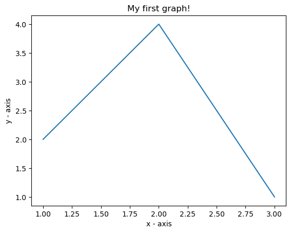
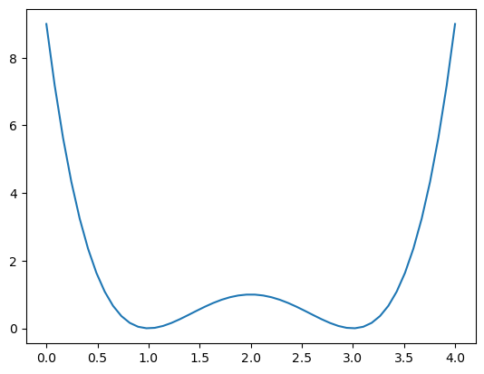

# AGiSSN_Lab1


```python
# importing the required module  
import matplotlib.pyplot as plt
from mpmath.math2 import sqrt2

# x axis values  
x = [1,2,3]  
# corresponding y axis values  
y = [2,4,1]  
    
# plotting the points   
plt.plot(x, y)  
    
# naming the x axis  
plt.xlabel('x - axis')  
# naming the y axis  
plt.ylabel('y - axis')
    
# giving a title to my graph  
plt.title('My first graph!')  
    
# function to show the plot  
plt.show()  
```


    

    


```python
import numpy as np

x=np.linspace(0,4,50)
print(x)
```

    [0.         0.08163265 0.16326531 0.24489796 0.32653061 0.40816327
     0.48979592 0.57142857 0.65306122 0.73469388 0.81632653 0.89795918
     0.97959184 1.06122449 1.14285714 1.2244898  1.30612245 1.3877551
     1.46938776 1.55102041 1.63265306 1.71428571 1.79591837 1.87755102
     1.95918367 2.04081633 2.12244898 2.20408163 2.28571429 2.36734694
     2.44897959 2.53061224 2.6122449  2.69387755 2.7755102  2.85714286
     2.93877551 3.02040816 3.10204082 3.18367347 3.26530612 3.34693878
     3.42857143 3.51020408 3.59183673 3.67346939 3.75510204 3.83673469
     3.91836735 4.        ]


```python
import numpy as np
import matplotlib.pyplot as plt

x=np.linspace(0,4,50)

y = ((x**2)-(4*x)+3) ** 2

plt.plot(x,y)
plt.show()
```



    

